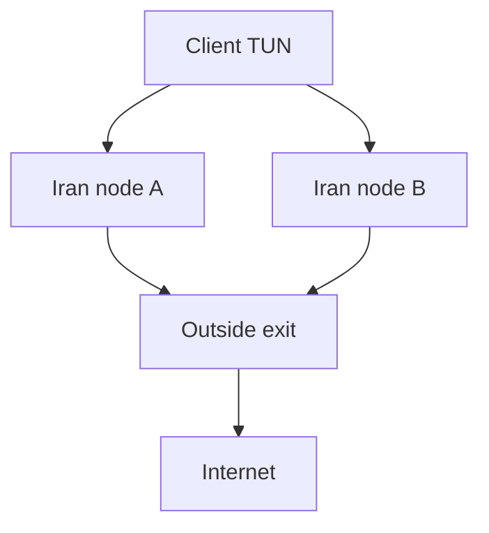

# Architecture

## Packet path

Direct mode:

1. A client TUN or system proxy sends TCP/UDP connections to an Iranian entry.
2. The entry offers Hysteria 2/QUIC and VLESS/REALITY/TCP listeners. Both require separate, unique credentials.
3. The Iran node forwards authenticated traffic through a `urltest` group to the Outside Hysteria 2 or VLESS/REALITY endpoint.
4. Outside exits directly to the Internet. No x-ui config file is read or rewritten.

Reverse mode uses the same transports in the opposite topology: the client enters through Outside, Outside selects a healthy Iran exit, and the Iran server exits to the Internet. This is generated as a separate bundle because a single inbound on one port cannot safely route some users to direct egress and other users to the reverse path without a more complex routing layer.

The user client performs the Iran-node URL tests. Each Iran config tests the two Outside transports. This avoids DNS-only failover and uses reachable addresses directly. `urltest` latency/health probes do not migrate existing flows: a failed path can interrupt active TCP/UDP sessions, which then need to reconnect.

The generator asks for the `urltest` interval. Shorter intervals such as `10s` detect failed paths faster, but add more active checks. Existing TCP/UDP flows still reconnect as new sessions after a path change.

All generated Linux routes enable sing-box interface auto-detection. Client TUN profiles also use `dns_mode: hijack` and a typed sing-box 1.14 DoH resolver sent through the selected tunnel path.

## Addressing and ports

Each server binds Hysteria 2 on UDP and REALITY on TCP. The default REALITY base ports are Outside TCP/7788 and Iran TCP/8877 to make the two sides easy to read. Extra SNI fallbacks consume the next TCP ports in order. Hysteria and REALITY may share a numeric port only because they use different transport protocols, but choose distinct ports if x-ui or another service already owns one. The wizard only writes configs and install metadata. The installer may maintain Raah's isolated hopping DNAT table, while allow rules in UFW and the provider firewall remain explicit and manual.

Hysteria2 client-side port hopping uses `server_ports` and `hop_interval`, while the sing-box server keeps one UDP listener. Each server JSON therefore has a matching `.install.json`; the installer uses it to maintain a dedicated `inet raah_porthop` nftables DNAT table and systemd unit. This does not open the provider firewall: every UDP range in `DEPLOY.txt` must also be allowed in the VPS control panel.

Hysteria server TLS cert/key paths must exist on the host where that config runs. Certificate hostnames/SNI are asked separately from the public IP/domain used to dial. If using a CDN DNS provider, configure a DNS-only record for the Hysteria endpoint.

The generator asks for default Iran TLS values and then lets each Iran entry override its TLS hostname and certificate/key paths. This supports entries on different domains while keeping the simple one-answer path for identical hosts.

REALITY SNI values can be entered manually or suggested with `raahctl sni-scan` / `generate --auto-sni`. The scanner opens real TLS connections to candidate hostnames on TCP/443, measures handshake time, estimates jitter from repeated attempts, and ranks candidates. When several SNIs are entered, Raah creates one REALITY inbound/outbound pair per SNI on sequential TCP ports, then includes all of them in `urltest`. The result reflects the route from the machine running the scan, so repeat it from the networks that matter.

## Security boundaries

- Each generated bundle contains server private keys and user credentials. Treat it like a password vault export.
- Raah transport credentials are node-to-node secrets. End-user credentials, expiry, quotas, and revocation belong exclusively to x-ui/3x-ui. The legacy user-editing commands remain only for old bundles and must not be used alongside x-ui.
- `raahctl doctor` checks generated config files for common deployment issues. `raahctl firewall-plan` derives UFW allow commands from generated listen ports. It prints commands for review instead of changing firewall state itself.
- x-ui/3x-ui quotas apply to panel-managed inbounds. `raahctl quota-check` is host/interface scoped and uses kernel byte counters since boot. `raahctl audit-report` can summarize Xray access-log metadata by user and destination, but cannot reveal HTTPS paths or content.
- The URL health endpoint tests general reachability through the configured path. `raahctl probe` measures only TCP connection setup. `raahctl e2e-probe CLIENT_CONFIG` starts a temporary localhost-only sing-box client and performs HTTP(S) requests through the complete configured route. For game-specific RTT, UDP behavior, and packet loss, validate from each carrier and client location.
- Direct and reverse bundles generated with the same ports are alternatives. Change ports before running both on the same host at the same time.
- No route can deliver traffic when the Iran host has lost all upstream connectivity. A second entry on a different provider helps only while clients can reach it.
- Do not put private bundle files or runtime keys in issues, screenshots, repositories, or chat.
