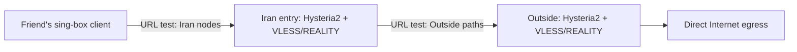

# Raah Tunnel

[English](README.md) · **فارسی** · [LICENSE](LICENSE) · [CHANGELOG](CHANGELOG.md) · [ARCHITECTURE](docs/ARCHITECTURE.md) · [PROTOCOLS](docs/PROTOCOLS.md)

[](https://github.com/qasamij/raah-tunnel/actions/workflows/python-package.yml)
[](https://www.python.org/downloads/)
[](https://sing-box.sagernet.org/)
[](LICENSE)
[](https://ubuntu.com/)

If `git clone` is slow or blocked on your network, the installer automatically retries the same ref as a single HTTPS archive from `codeload.github.com`. To change that behaviour:

```bash
sudo RAAH_TARBALL_TIMEOUT=180 bash /tmp/raah-install.sh --menu   # more time for a slow link
sudo RAAH_REF=main bash /tmp/raah-install.sh --menu              # install the latest main branch
```

**A practical multi-transport gateway for Iran ↔ Outside.** Raah is the server-to-server transport layer. x-ui/3x-ui remains the owner of end-user inbounds, UUIDs, passwords, expiry, quotas, and the panel. It pairs a QUIC path for UDP-capable traffic with a TCP/REALITY fallback and health-based selection.

> Raah is an early, community-oriented project. No transport can promise immunity from blocking, detection, power loss, provider filtering, or a full network outage. Test on your own VPS and network before relying on it.

## What this first cut does

- Generates separate Outside, Iran-entry, and Linux client configurations for direct, reverse, or both topologies.
- Uses Hysteria 2 over QUIC (TCP + UDP proxy traffic) and VLESS/REALITY over TCP as independent paths.
- Scans REALITY SNI candidates and builds fallback REALITY paths; each SNI uses its own TCP port and `urltest` selects the healthier path.
- Configures automatic URL tests to choose a healthy Outside transport and Iranian entry node.
- Accepts multiple Iranian public addresses in the client profile for client-side latency selection/failover (not concurrent bandwidth distribution).
- Lets you choose ports; it never modifies x-ui or opens UFW/provider-firewall ports. When hopping is enabled, the installer maintains only Raah's isolated nftables DNAT table.
- Writes outputs with restrictive permissions and never embeds private keys in this repository.
- Includes operational helpers for UFW planning, deployment checks, host/interface traffic limits, and privacy-aware Xray/x-ui access-log reporting.
- Includes an interface byte-counter utility and a remote TCP health-check/Telegram alert helper.
- Includes an end-to-end client-profile probe through the Iran entry, Outside exit, and an HTTP(S) target.

The generated client profile is for `sing-box` clients with TUN support. Proxies carry TCP and UDP. ICMP and other arbitrary IP protocols are not transported as a full Layer-3 VPN by this proxy design.

## Quick start

Requirements: Ubuntu 22.04/24.04 or newer, root access, and sing-box 1.14 or newer. The automatic installer downloads Git, Python, required tools, Raah, and the official `sing-box` package from its signed APT repository. Hysteria 2 still requires a valid certificate and key.

```bash
git clone https://github.com/qasamij/raah-tunnel.git
cd raah-tunnel
python3 raahctl.py generate --out ./private-bundle
python3 raahctl.py edit-bundle ./private-bundle
```

### One-click node install

On the first trusted server, download the installer and create the shared pair bundle:

```bash
curl -fsSL https://raw.githubusercontent.com/qasamij/raah-tunnel/main/one-click-install.sh -o /tmp/raah-install.sh && \
sudo bash /tmp/raah-install.sh --menu
```

Choose bundle generation from the English/ASCII menu. Generate the pair only once. For direct mode, transfer only `outside.json` to the outside server and `iran-01.json` to the Iran server. Install on the **outside server**:

```bash
sudo bash /tmp/raah-install.sh --config /root/raah-private-bundle/outside.json --start
```

Install on the **Iran server**:

```bash
curl -fsSL https://raw.githubusercontent.com/qasamij/raah-tunnel/main/one-click-install.sh -o /tmp/raah-install.sh
sudo bash /tmp/raah-install.sh --config /root/raah-private-bundle/iran-01.json --start
```

Copy each private JSON via SCP to the stated path or adjust the path in the command. Never publish it. The installer downloads Ubuntu dependencies, the repository, and official sing-box; valid TLS certificates and firewall rules are still required. Raah does not automatically route existing x-ui inbounds through its transport. Configure panel routing separately.

Generate direct, reverse, or both bundles:

```bash
python3 raahctl.py generate --mode direct --out ./private-bundle
python3 raahctl.py generate --mode reverse --out ./private-reverse
python3 raahctl.py generate --mode both --out ./private-both
```

Let the tool suggest a REALITY SNI pool:

```bash
python3 raahctl.py sni-scan
python3 raahctl.py generate --auto-sni --sni-pool-size 3 --out ./private-bundle
```

The wizard asks for the Outside address, one or more Iranian entry addresses, ports, REALITY handshake names, and certificate paths. It produces:

- `outside.json`
- `outside.install.json` (server-side port-hopping/DNAT metadata)
- `iran-01.json`, `iran-02.json`, … (one matching config per Iran entry node)
- `iran-01.install.json`, `iran-02.install.json`, …
- `client-linux.json`
- `DEPLOY.txt` with the exact ports and safe deployment commands

Reverse mode creates `reverse-outside-entry.json`, `reverse-iran-exit-01.json`, their matching `.install.json` files, and `reverse-client-linux.json`. Mode `both` creates separate `direct` and `reverse` directories. Keep each server JSON and matching install metadata together when copying or installing it.

For a manual install, copy the script and the matching private config to each host. Run separately:

**Outside server:**

```bash
cd /opt/raah-tunnel
sudo bash scripts/install-unit.sh /root/raah-private-bundle/outside.json
sudo systemctl enable --now raah-sing-box
```

**Iran server:**

```bash
cd /opt/raah-tunnel
sudo bash scripts/install-unit.sh /root/raah-private-bundle/iran-01.json
sudo systemctl enable --now raah-sing-box
```

On a second Iran host use its own `iran-02.json`. After replacing an existing config, run `sudo systemctl restart raah-sing-box`.

The helper does not open firewall ports or restart x-ui. For port hopping it does maintain an isolated `raah_porthop` nftables DNAT table; allow the complete UDP range separately in UFW and the VPS provider firewall.

The default Outside REALITY base port is TCP/7788 and the default Iran REALITY base port is TCP/8877. If you enter several SNIs, Raah uses the next ports in order, for example Outside `7788, 7789, 7790` and Iran `8877, 8878, 8879`.

Advanced mode asks for separate Outside/Iran `urltest` URLs and the health interval. The default URL is `https://cp.cloudflare.com/generate_204`; use menu option 8 to change it if that endpoint is unreliable on either real path. Use `10s` for more aggressive failover checks or the calmer default `15s`.

## Design



Iran and Outside run independent `sing-box` services under `/etc/raah`; x-ui's files and service are left alone. If x-ui already owns a chosen port, select different ports before generating configs. Client `urltest` selects a best reachable entry for that client; it does not distribute multiple clients evenly across nodes. Health selection affects new connections; existing sessions can drop during a path change and reconnect.

## Commands

```bash
python3 raahctl.py generate --out ./private-bundle
python3 raahctl.py validate ./private-bundle/outside.json
python3 raahctl.py validate ./private-bundle/iran-01.json
python3 raahctl.py validate ./private-bundle/client-linux.json
python3 raahctl.py sni-scan
python3 raahctl.py stats --interface eth0
python3 raahctl.py quota-check --interface eth0 --limit-gb 500
python3 raahctl.py status --interface eth0
python3 raahctl.py doctor ./private-bundle
python3 raahctl.py list-users ./private-bundle/iran-01.json
python3 raahctl.py add-user ./private-bundle/iran-01.json --name ali --expires-at 2026-12-31T23:59:00Z --quota-gb 50 --out ./iran-01.with-ali.json
python3 raahctl.py enforce-users ./iran-01.with-ali.json
python3 raahctl.py revoke-user ./private-bundle/iran-01.json --user friends --out ./iran-01.revoked.json
python3 raahctl.py firewall-plan ./private-bundle --ssh-port 22
python3 raahctl.py probe --host ir-entry.example.net --port 8877 --count 20
python3 raahctl.py e2e-probe ./private-bundle/client-linux.json --count 5
python3 raahctl.py check --host ir-entry.example.net --port 8877 --telegram-env
python3 raahctl.py watch --host ir-entry.example.net --port 8877 --interval 30 --telegram-env
```

User lifecycle and quotas belong in x-ui/3x-ui. The legacy `add-user`, `list-users`, `revoke-user`, and `enforce-users` commands remain only for old bundles and must not become a second user database. `audit-report` aggregates Xray/x-ui access-log metadata by user and destination without inspecting payloads. For HTTPS this normally means a domain/SNI, not the full URL path or page content. `doctor` checks generated configs, `firewall-plan` prints UFW commands, and `stats`/`quota-check` report host-wide interface totals rather than per-user billing.

`e2e-probe` validates a generated client profile, starts a temporary mixed/SOCKS listener bound only to `127.0.0.1`, and sends HTTP(S) requests through the complete configured route. Use `--outbound TAG` to test one transport; omit it to test the configured final/urltest selection. Run it from the real client network for meaningful results.

`edit-bundle` interactively updates addresses, transport ports, per-side REALITY SNI pools, per-side health URLs, and Hysteria2 hopping. It locks the bundle, creates a private timestamped backup, keeps only the newest three backups, preserves keys and credentials, and regenerates all matching server, metadata, and client files from `secrets.json`. Reinstall each affected server JSON together with its matching `.install.json`, then redistribute updated client profiles.

After the first installation, open the menu with `sudo raah-install --menu`. Option 9 updates to the newest published stable `v*` tag. Option 10 removes the Raah service, `/etc/raah`, the installed checkout and launcher after an explicit confirmation; deletion of `/root/raah-private-bundle` requires a second confirmation. The shared sing-box package is intentionally retained.

## Security and operating notes

- Never put generated JSON, certificates, private keys, passwords, or client profiles in GitHub. `.gitignore` blocks the default output folder.
- Use a different Hysteria password, Salamander password, UUID, and REALITY key set for each deployment.
- Bind admin/monitoring services to loopback or a private management network. Raah exposes no public management API.
- Explicitly allow only the configured TCP and UDP ports in the provider firewall and host firewall.
- Set accurate bandwidth ceilings only after measuring the real path. Overstating a cap can increase loss and jitter.
- SNI scan results are local to the machine running the scan. For better choices, run `sni-scan` from Iran and Outside. With multiple SNIs, sing-box uses `urltest` to move new connections to another REALITY path when one path degrades.
- Cloudflare/Arvan DNS can help publish or change DNS answers; DNS alone cannot keep a live session alive after a server or route fails. Client-side health selection needs all entry addresses in the profile.
- Cloudflare's ordinary orange-cloud HTTP proxy is not a generic Hysteria/QUIC forwarder. Use direct DNS resolution for Hysteria endpoints. REALITY is not a cure-all and its handshake target must be reachable and configured correctly.
- Direct mode means clients enter through Iran and Outside exits. Reverse mode means clients enter through Outside and one Iran server exits. If you run both modes on the same host at the same time, change one mode's ports first.
- Client profiles use sing-box 1.14 TUN DNS hijacking and encrypted DoH through the selected tunnel path. Legacy top-level FakeIP syntax was removed in sing-box 1.14, so Raah does not emit that obsolete block.
- Hysteria2 port hopping is coordinated end to end. The client receives `server_ports`/`hop_interval`; the matching `.install.json` makes a separate `raah-port-hop` systemd service install an isolated nftables DNAT table. You must still open the complete UDP range shown in `DEPLOY.txt` in the VPS provider firewall.
- A TCP fallback can carry UDP-based application data through proxy packet encoding, but it adds latency and head-of-line effects. For real-time games, it is a survival path, not equivalent to a working UDP path.

## Scope and roadmap

This release is a transport/config generator and operations toolkit, not a hosted control panel. Enable Xray access logs in x-ui only with user notice, keep them mode `600`, rotate them, and use a short retention period. `audit-report` summarizes metadata; it does not capture message bodies or forward raw browsing logs to Telegram.

## License

MIT. See [LICENSE](LICENSE).
